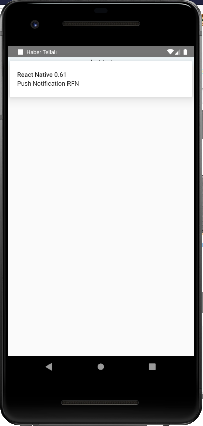

## ScreenShots

i used this repo in my [Haber-Tellali-3th-Wave-News-Service](https://github.com/inceabdullah/Haber-Tellali-3th-Wave-News-Service/tree/master/react-native/rfn-typescript) as the base.

### installation

- This is belonging to [invertase](https://github.com/invertase/)
I used version 5.4.0 of ***react-native-firebase-starter***
`git clone https://github.com/invertase/react-native-firebase-starter.git`

- A bunch of code of [Katharine Padilha](https://gist.github.com/katharinepadilha/d82502b4abbe6be3a244783ff5b8652e) was  used to get notifications on Android.

		async getToken() {
    	let fcmToken = await AsyncStorage.getItem('fcmToken');
    	if (!fcmToken) {
        fcmToken = await firebase.messaging().getToken();
        if (fcmToken) {
            await AsyncStorage.setItem('fcmToken', fcmToken);
    	    	}
	    	}
		}

		async checkPermission() {
    		const enabled = await firebase.messaging().hasPermission();
    		if (enabled) {
        		this.getToken();
    		} else {
        		this.requestPermission();
    		}
		}

		async requestPermission() {
    		try {
        		await firebase.messaging().requestPermission();
        		this.getToken();
    		} catch (error) {
        		console.log('permission rejected');
    		}
		}

		async createNotificationListeners() {
    		firebase.notifications().onNotification(notification => {
        		notification.android.setChannelId('insider').setSound('default')
        		firebase.notifications().displayNotification(notification)
    		});
		}

		componentDidMount() {
    				const channel = new firebase.notifications.Android.Channel('insider', 'insider channel', firebase.notifications.Android.Importance.Max)
    		firebase.notifications().android.createChannel(channel);
    		this.checkPermission();
    		this.createNotificationListeners();
		}
		
		

- I have used typecript for developing my React Native projects. So, I had to migrate my any React Native project to TypeScript. For this, I used the way [Michał Zamorski](https://itnext.io/migrating-a-react-native-app-to-typescript-21f3a3d5ff57) gave.:

That is like:
`npm i --save-dev react-native-typescript-transformer typescript tslib ts-jest`
`npm uninstall --save-dev babel-eslint eslint eslint-plugin-react`
`npm uninstall --save prop-types`
`npm install --save-dev @types/jest @types/react @types/react-native @types/react-navigation @types/react-redux @types/react-test-renderer`
`npm i -g typescript tslint`
`tslint --init`
`tslint -p tsconfig.json`

Then, Sure thing. I created specific google-services.json file for my package name: `com.invertase.rnfirebasestarter`

That is it.

### Push Notification

i could get push notification with image even my react native version is 0.61

